# Cloud Security Hardening and Compliance Audit

## Scenario — What Problem Are We Solving?

This project simulates a scenario that plays out in real cloud environments more often than anyone likes to admit. A company that has been moving fast discovers its AWS account has drifted away from secure defaults, and nobody noticed because there was nothing watching.

A B2B SaaS company has been on AWS for 18 months. Engineers built things quickly, made changes when they needed to, and moved on. No formal security governance. No automated compliance monitoring. No audit trail beyond what the team could remember. That worked fine, until the company signed a letter of intent with its first enterprise customer, a financial services firm that requires vendors to pass a cloud security review before any contract can execute.

The procurement team submits three questions. Are your S3 buckets protected against unintended public access? Do your IAM users operate under the principle of least privilege? Is SSH access to your compute resources restricted to authorized sources only?

The engineering team answers yes to all three. A security audit reveals the actual state of the account, which tells a different story. 

A bucket created for a temporary marketing file share seven months ago still has Block Public Access disabled. A developer uploaded a configuration file containing an internal API key in March. That file has been publicly accessible for seven months with no authentication required. An IAM user created for an external contractor in January still has AdministratorAccess attached directly. The contractor's engagement ended in April and the credentials were never deactivated. A security group created during a production debugging session in May has SSH open to 0.0.0.0/0. An EC2 instance is running with that security group attached. GuardDuty confirms active brute force attempts against it within 24 hours.

The answer to all three questions on the questionnaire is no. Submitting those answers as-is would be a misrepresentation to an enterprise customer and a compliance liability for the business.

The goal of this project is to audit the environment, demonstrate the real-world impact of each finding, remediate each misconfiguration, implement continuous compliance monitoring so this cannot happen again, and produce documented evidence that the account meets the requirements the questionnaire asks about.

This is my fourth AWS project. The first three were about building infrastructure. This one is about auditing it: finding what is wrong, proving the consequences are real, fixing it, and making sure it stays fixed.

---

## Architecture

This project is not a traditional infrastructure deployment. There is no VPC or subnet structure to provision from scratch. The architecture is a security monitoring and enforcement layer applied on top of an existing AWS account, built around a before-and-after audit structure.

Three resources are created deliberately as misconfigured audit targets. Monitoring tools are enabled to detect them. The before state is documented with evidence of real-world impact. Each misconfiguration is remediated. The after state is verified and documented in a written audit summary.

```
BEFORE STATE:
  S3 bucket with public access enabled    →  credentials file accessible to anyone on the internet
  IAM user with AdministratorAccess       →  full account access exposed through forgotten credentials
  EC2 instance with SSH open to world     →  brute force attempts confirmed by GuardDuty within 24 hours

MONITORING:
  AWS Config        →  detects all three violations against managed compliance rules
  AWS CloudTrail    →  logs every API call and configuration change with timestamps
  Security Hub      →  aggregates Config and GuardDuty findings in one dashboard
  GuardDuty         →  detects real SSH brute force activity from VPC flow log analysis

AFTER STATE:
  All three Config rules: COMPLIANT
  EventBridge and SNS fire on any future compliance drift
  CloudWatch alarm triggers on unauthorized API call patterns
  Audit summary report documents all findings and remediation evidence
```

*Architecture diagram coming soon.*

---

## AWS Services Used

- **AWS Config** is the core detection tool. It continuously monitors resources against compliance rules and flags violations within minutes of them occurring.
- **AWS CloudTrail** logs every API call in the account with timestamps and identity attached. Log file validation creates a cryptographic hash chain proving logs have not been tampered with after delivery.
- **AWS Security Hub** aggregates findings from Config and GuardDuty into one centralized dashboard. A security score reflects the overall compliance posture of the account.
- **Amazon GuardDuty** analyzes VPC flow logs, CloudTrail logs, and DNS logs for malicious activity. In this project it surfaces real SSH brute force attempts against the deliberately vulnerable EC2 instance.
- **AWS IAM** is the target of one of the three audit remediations. AdministratorAccess attached directly to a user violates least privilege and is flagged by the iam-user-no-policies-check Config rule.
- **Amazon S3** is the target of one of the three audit remediations. A bucket with public access enabled violates the s3-bucket-public-read-prohibited Config rule and exposes files without authentication.
- **Amazon EC2** provides the t2.micro instance launched with the vulnerable security group to generate real VPC flow log activity for GuardDuty to analyze. It is terminated after findings are captured.
- **Amazon EventBridge** triggers an SNS email whenever Config reports any resource moving to NON_COMPLIANT. This is the continuous alerting layer for any future drift.
- **Amazon SNS** sends email alerts when EventBridge detects a compliance change or when the CloudWatch unauthorized API alarm fires.
- **Amazon CloudWatch** hosts the metric filter that watches CloudTrail logs for unauthorized API call patterns and fires an alarm when the pattern is detected.

---

## Obstacles — Constraints and Security Requirements

**The misconfigurations must be documented before anything is fixed.**
In a real engagement a client needs proof that the vulnerabilities existed before they will authorize the remediation work. Screenshots of Config violations, GuardDuty findings, and direct demonstrations of exploitability are the evidence package. The before state must be documented first.

**Real-world impact must be demonstrated, not just described.**
Saying a public S3 bucket is a security risk is not the same as showing a credentials file downloading in an incognito browser with no authentication. Saying an overpermissioned IAM user is dangerous is not the same as running CLI commands that prove full account access using those credentials. Saying an open SSH port attracts attacks is not the same as showing GuardDuty findings confirming active brute force attempts within 24 hours of launch. This project demonstrates the consequences rather than describing them.

**Continuous monitoring must replace one-time checking.**
Fixing three misconfigurations and declaring the environment secure is not the same as making it stay secure. EventBridge must be configured to fire an SNS alert the moment any resource drifts out of compliance again. The difference between a security audit and a security posture is what happens after the audit is done.

**Unauthorized API activity must be detectable in real time.**
CloudTrail logs every API call but does not alert on its own. A CloudWatch metric filter on the CloudTrail log group must detect the pattern of AccessDenied and unauthorized access errors that signal either compromised credentials being used or permission boundaries being probed. The alarm fires before a human would notice manually.

**The audit must produce documented evidence.**
The technical fixes are half the job. The other half is the audit summary, a written document that translates the findings, the demonstrated impact, and the remediation actions into something a non-technical stakeholder can read and act on. This project produces that document as a deliverable committed to the repository alongside the screenshots.

---

## Actions — What Was Built and Why

### Step 1 — Create Misconfiguration 1: Public S3 Bucket with Exposed Credentials

The first audit target is an S3 bucket with Block Public Access disabled. In the scenario, this bucket was created for a temporary file share and never locked down. A developer uploaded a configuration file containing internal API keys that has been publicly accessible for seven months with no authentication required.

I created the bucket with Block Public Access unchecked and acknowledged the warning that the bucket would be public. Disabling Block Public Access alone is not enough to expose objects — AWS also requires a bucket policy explicitly granting public read access as an additional confirmation step. I added the policy, which reflects exactly how real accidental public exposure happens in production accounts.

<div align="center">

</div>

To simulate the credential exposure, I created a fake configuration file on my Mac and uploaded it to the bucket. I confirmed the file was created correctly by printing its contents in the terminal before uploading.

<div align="center">

</div>

I then opened the S3 object URL in an incognito browser window with no AWS login, no credentials, and no authentication of any kind. The file loaded immediately.

<div align="center">

</div>

This is Finding 1 demonstrated. A file containing API keys and database connection strings is readable by anyone who finds the URL. No attack tool required. Just a browser.

---

### Step 2 — Create Misconfiguration 2: IAM User with AdministratorAccess

The second audit target is an IAM user with AdministratorAccess attached directly at the user level rather than through a group. In the scenario, this user was created for a contractor whose engagement ended months ago. The credentials were never deactivated.

I created audit-test-user and attached AdministratorAccess directly.

<div align="center">

</div>

To demonstrate the blast radius I generated access keys for the user, configured a temporary CLI profile named audit-demo, and ran four commands proving exactly what those credentials can access.

<div align="center">

</div>

<div align="center">

</div>

The output confirmed full account access. The caller identity showed AdministratorAccess, every S3 bucket in the account was listed, every IAM user was visible, and the policy confirmed unrestricted access to all AWS actions and all resources. The access keys were deleted immediately after capturing this output.

This is Finding 2 demonstrated. Anyone who finds these credentials has full administrative control of the AWS account.

---

### Step 3 — Create Misconfiguration 3: Security Group with SSH Open and EC2 Instance

The third audit target is a security group with port 22 open to 0.0.0.0/0. In the scenario, this security group was created during a production debugging session and never cleaned up. An EC2 instance is actively running with it attached.

I created the security group audit-open-ssh-sg with an inbound SSH rule allowing any IPv4 address.

<div align="center">

</div>

I then launched a t2.micro EC2 instance with this security group attached to generate real VPC flow log activity for GuardDuty to analyze. A security group sitting idle with no running instance generates no traffic. A running instance with a public IP actively receives connection attempts from internet scanners.

<div align="center">

</div>

To accelerate GuardDuty detection I made several intentional failed SSH connection attempts from my Mac terminal using a nonexistent username. Each attempt returned Permission denied, which is logged in VPC flow data that GuardDuty analyzes for brute force patterns.

<div align="center">

</div>

This is Finding 3 in place. Internet scanners and intentional failed attempts are now generating the activity GuardDuty needs to surface real threat findings.

---

### Step 4 — Enable CloudTrail

CloudTrail must be running before any remediation begins. Every change made from this point forward needs to be logged with a timestamp and identity attached. This is the chain of custody for the audit.

I created the trail project-4-audit-trail with multi-region logging enabled, log file validation turned on, and CloudWatch Logs integration configured. Log file validation creates a cryptographic hash chain proving the logs have not been altered since delivery.

<div align="center">

</div>

---

### Step 5 — Enable AWS Config and Compliance Rules

AWS Config is the automated compliance monitor for this project. I set up the recorder for all resources and added three managed rules that map directly to the three misconfigurations created in Steps 1 through 3: s3-bucket-public-read-prohibited, iam-user-no-policies-check, and restricted-ssh.

<div align="center">

</div>

Within minutes of the rules being saved Config completed its initial evaluation. All three rules returned Noncompliant immediately, confirmed automatically with no manual input required.

<div align="center">

</div>

---

### Step 6 — Enable Security Hub

Security Hub was initially unavailable due to an account plan restriction. After upgrading to a standard AWS account the service became accessible. Security Hub was enabled with both the AWS Foundational Security Best Practices and CIS AWS Foundations Benchmark standards active. It will begin aggregating findings from Config and GuardDuty as those services collect data.

<div align="center">

</div>

---

### Step 7 — Enable GuardDuty

GuardDuty was also unavailable under the original account plan and was enabled after the account upgrade. GuardDuty is now analyzing VPC flow logs from the EC2 instance launched in Step 3. It does not require manual VPC flow log configuration as it accesses the underlying flow data independently.

<div align="center">

</div>

---

### Step 8 — Document the Before State

Before remediating anything, the violation state needed to be captured as evidence. Config had already flagged all three rules as Noncompliant. Security Hub had populated findings from the initial scan.

<div align="center">
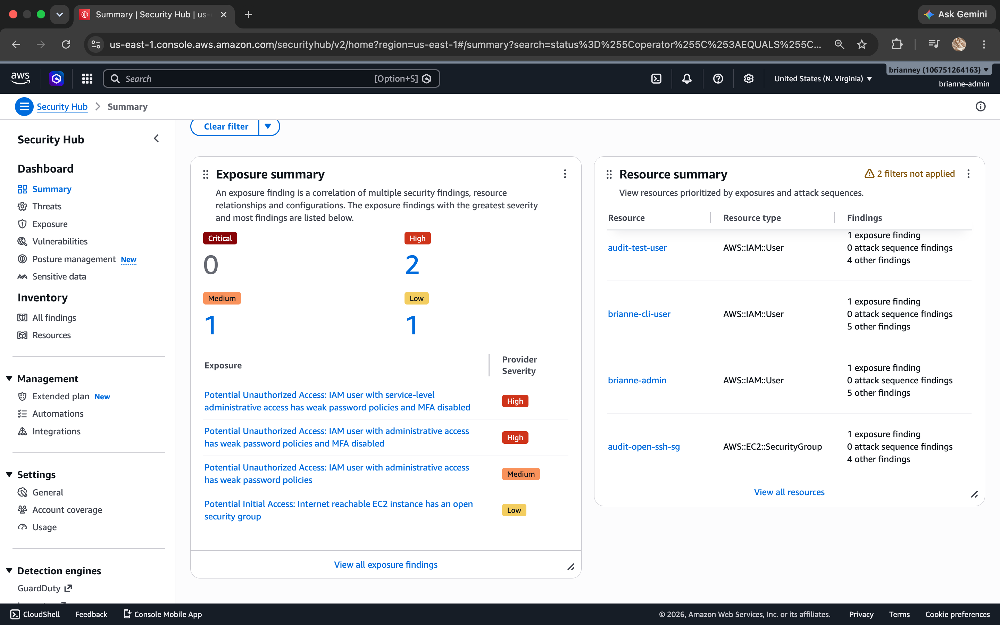
</div>

GuardDuty was enabled and monitoring the EC2 instance, but real SSH brute force findings did not surface within the expected window despite multiple rounds of intentional failed connection attempts from both the Mac terminal and AWS CloudShell. VPC flow logs were explicitly enabled on the default VPC as a troubleshooting step to ensure GuardDuty had the data it needed.

<div align="center">
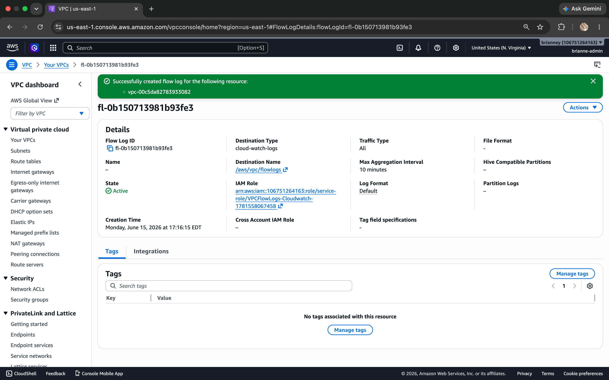
</div>

<div align="center">
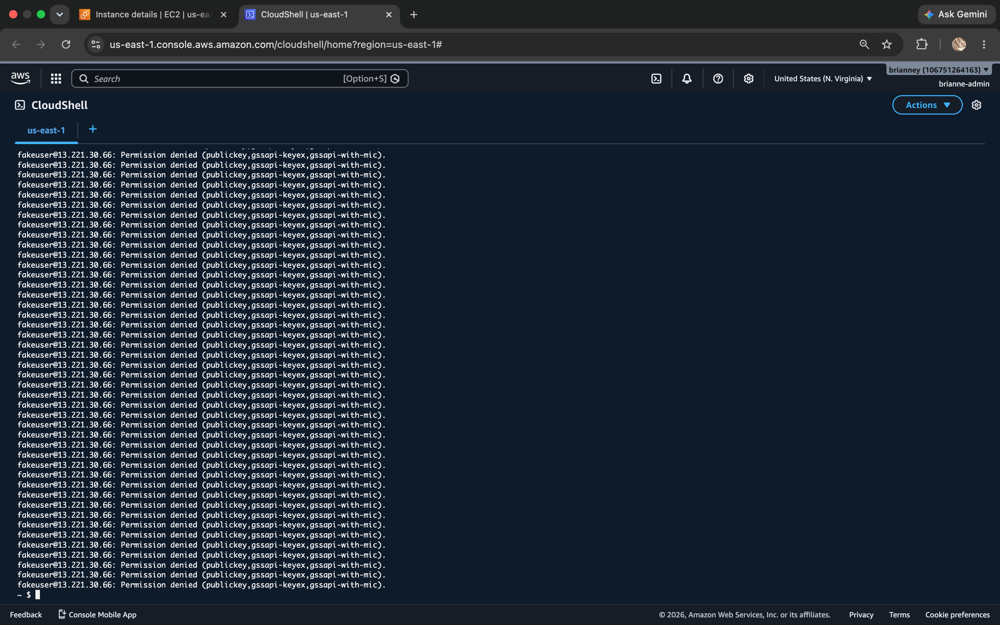
</div>

After several days without real findings, GuardDuty sample findings were generated using the built-in AWS sample findings feature to demonstrate what the detection looks like. The UnauthorizedAccess:EC2/SSHBruteForce finding confirms the type of threat activity an EC2 instance with port 22 open to 0.0.0.0/0 attracts in a real environment.

<div align="center">
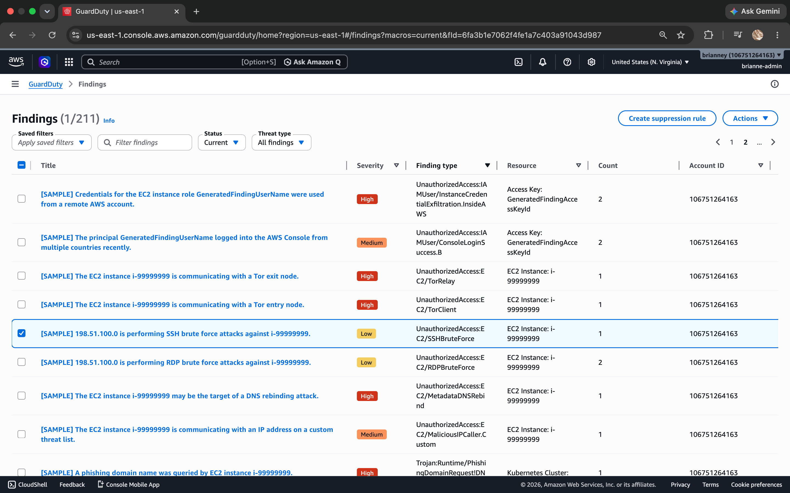
</div>

<div align="center">
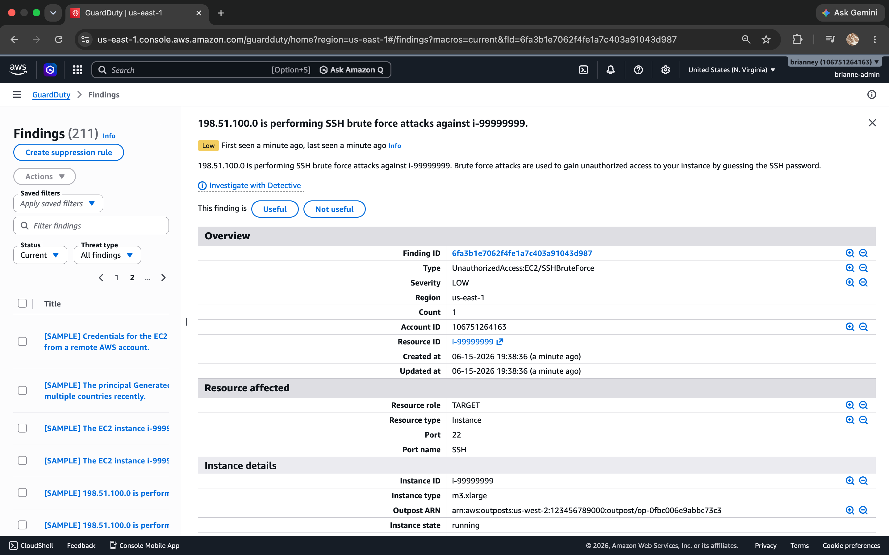
</div>

The troubleshooting process itself is documented honestly. Monitoring tools do not always behave predictably on newly upgraded accounts and diagnosing why is part of real security operations work.

---

### Step 9 — Remediate Each Misconfiguration

With the before state fully documented, each finding was remediated one at a time.

**Finding 1: S3 Public Access**

Block all public access was re-enabled on the audit-target bucket. Config re-evaluated the s3-bucket-public-read-prohibited rule within minutes and returned Compliant.

<div align="center">
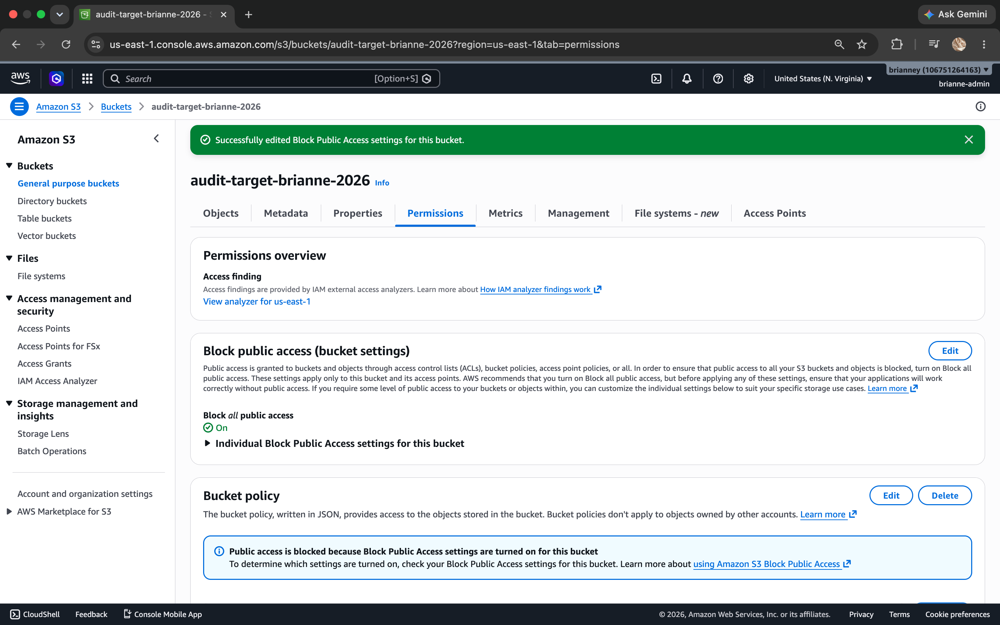
</div>

**Finding 2: IAM Over-Permission**

AdministratorAccess was removed from audit-test-user. Rather than attaching a new policy directly at the user level, which is itself a best practice violation, a group called audit-read-only-group was created with ReadOnlyAccess attached. The user was then added to the group. This corrects both the permission scope and the structural problem that direct policy attachment creates.

<div align="center">
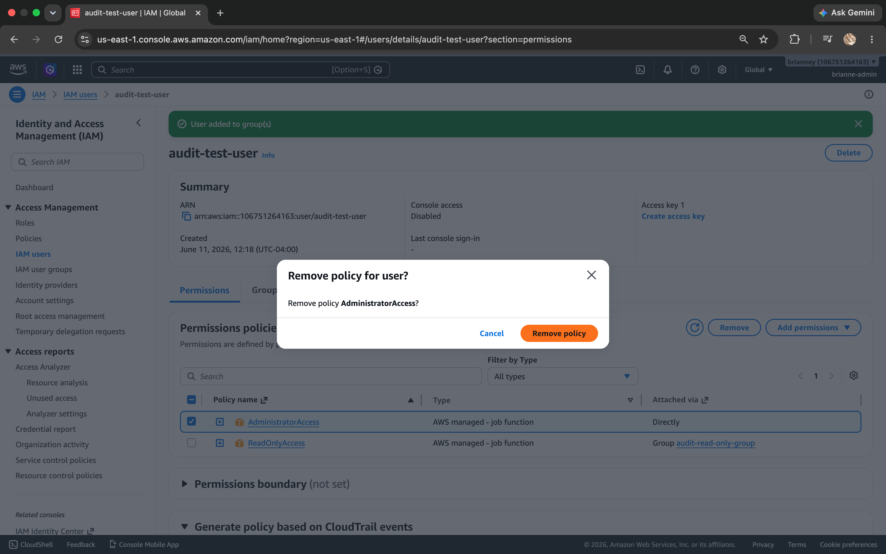
</div>

**Finding 3: Security Group SSH Open to World**

The SSH inbound rule on audit-open-ssh-sg was updated from source 0.0.0.0/0 to the current public IP address using the My IP option in the console. During this review, a separate pre-existing misconfiguration was also discovered: the default VPC security group had an allow-all inbound rule from a previous project. That rule was removed as well.

<div align="center">
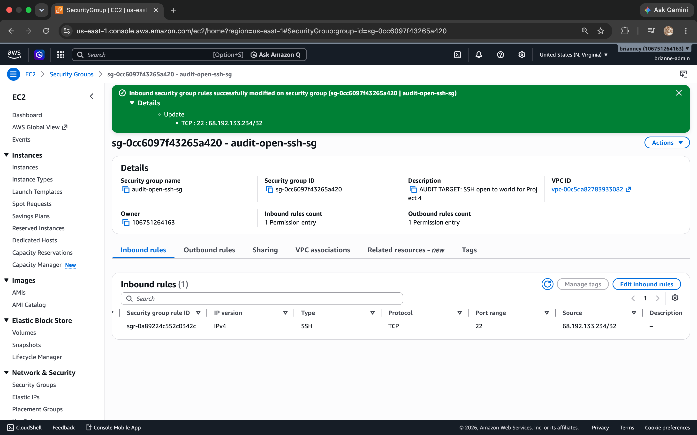
</div>

---

### Step 10 — Configure Automatic Remediation for Future Violations

Manual remediation fixes the immediate findings. Automatic remediation ensures that if the same misconfiguration reappears it gets corrected without waiting for human intervention.

AWS Config automatic remediation was configured for the s3-bucket-public-read-prohibited rule using the AWS-DisableS3BucketPublicReadWrite managed action. A dedicated IAM role was created for Config to assume when executing the remediation. Rather than attaching AmazonS3FullAccess, a scoped inline policy was created with only the two actions required: s3:PutBucketPublicAccessBlock and s3:GetBucketPublicAccessBlock. Automatic remediation configured with an overpermissioned role defeats the least-privilege principle this project is built around.

<div align="center">
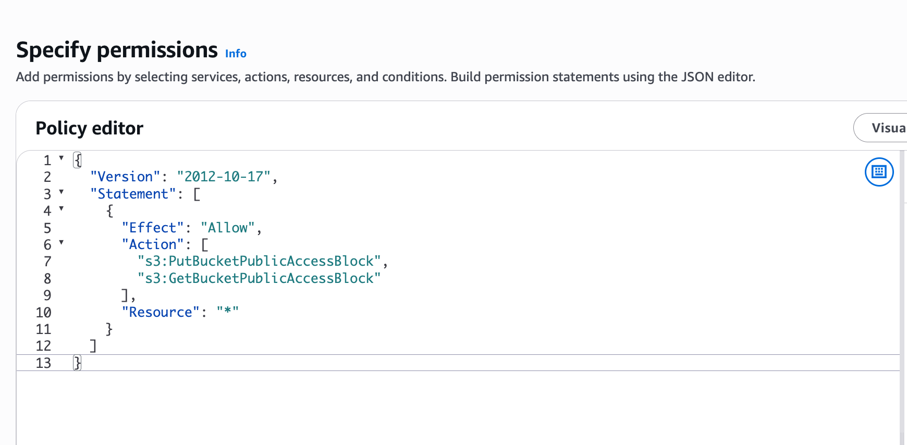
</div>

<div align="center">
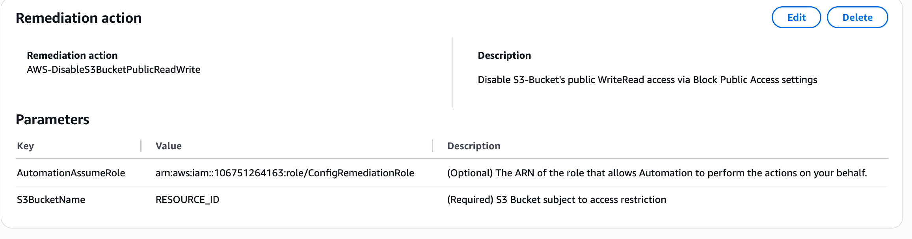
</div>

Automatic remediation was not configured for the IAM and SSH rules. The available managed actions for those findings carry risk of unintended impact on resources outside the scope of this audit. Manual remediation is documented for those findings and the rationale for not automating them is noted in the audit summary.

---

### Step 11 — Verify All Rules Compliant

After remediation, Config re-evaluated all three rules. The audit target resources for each rule returned Compliant.

The IAM rule shows the remediated audit-test-user as Compliant alongside a noncompliant resource from a prior project. That resource is outside the scope of this audit.

<div align="center">
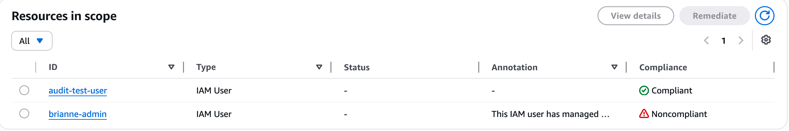
</div>

<div align="center">
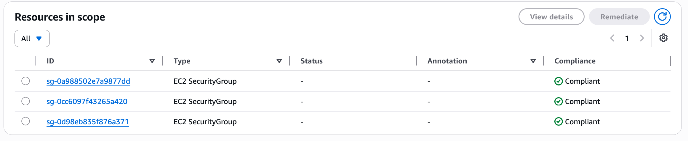
</div>

For the S3 rule, the audit-target bucket was confirmed remediated through the Permissions tab showing Block all public access fully enabled, captured in Step 9.

---

### Step 12 — Set Up Continuous Alerting for Future Drift

The environment is now compliant. The next requirement is making sure it stays that way without manual checking.

An EventBridge rule was created to fire whenever AWS Config detects any resource moving to NON_COMPLIANT. The rule uses a custom event pattern targeting Config compliance change events and routes them to the config-compliance-alerts SNS topic.

<div align="center">
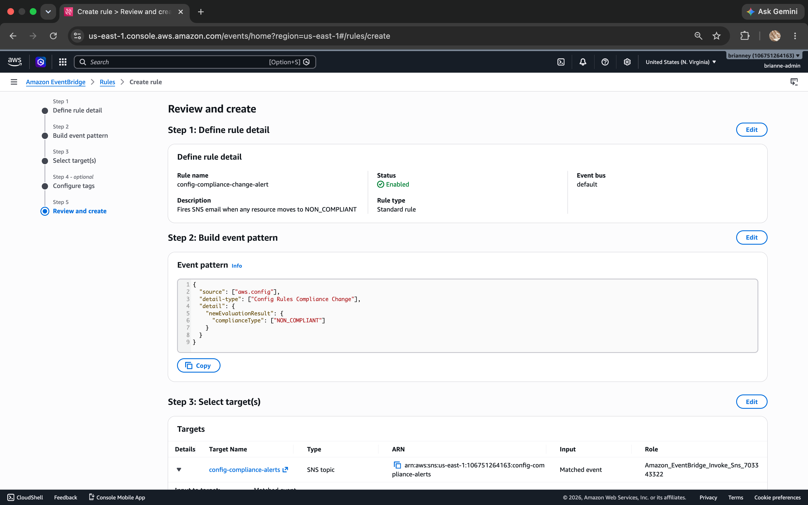
</div>

An email subscription was added to the SNS topic and confirmed.

<div align="center">
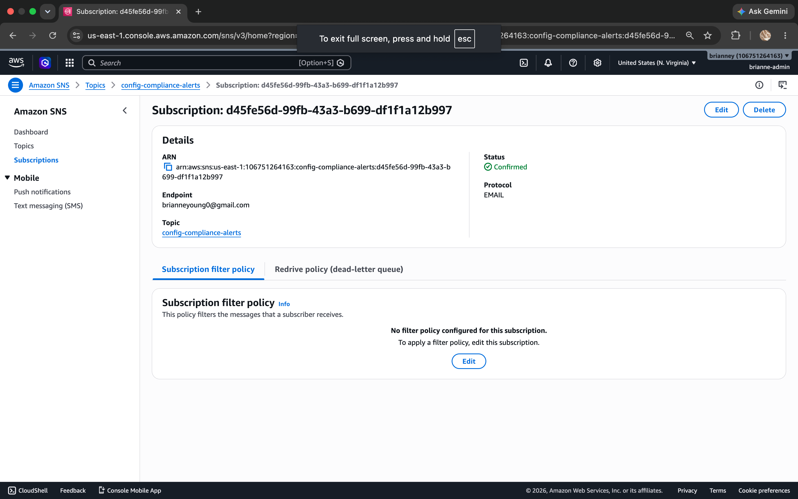
</div>

---

### Step 13 — CloudWatch Metric Filter and Alarm

CloudTrail logs every API call but does not alert on its own. A metric filter was created on the CloudTrail log group to watch for unauthorized API call patterns: AccessDenied, UnauthorizedAccess, and AuthFailure errors. These patterns signal either compromised credentials being used to probe the account or permission boundaries being exceeded.

The filter publishes to a custom metric namespace called CloudTrailMetrics. A CloudWatch alarm was configured on that metric with a threshold of Greater than 0 and a 5-minute evaluation period. The alarm routes to the config-compliance-alerts SNS topic.

Within minutes of the alarm being created it fired. An API call during the project matched the filter pattern, CloudWatch detected it, and an email arrived from SNS confirming the detection pipeline worked end to end.

<div align="center">
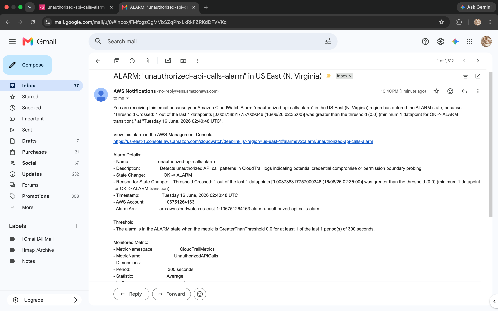
</div>

This is the most direct proof in the project that the monitoring stack is actively watching and responding to real activity in the account.

---

## Results — What the Working System Demonstrates

All three Config rules returned Compliant after remediation. The S3 credentials file is no longer publicly accessible. The IAM user no longer has direct policy attachment and operates under ReadOnlyAccess through a properly structured group. The security group no longer allows SSH from the entire internet. A pre-existing allow-all rule in the default security group was identified and removed during the review.

Automatic remediation is configured for the S3 rule using a least-privilege IAM role. EventBridge fires an SNS email the moment any resource drifts out of compliance. The CloudWatch metric filter detected a real unauthorized API call pattern and fired an alarm with an email notification during the build.

The audit summary report is committed to this repository alongside the screenshots. The before state is documented with evidence of real exploitability. The after state is verified and documented. The monitoring layer is active.

---

## Troubleshooting — Real Issues Encountered and Resolved

**Issue 1 — GuardDuty SSH brute force findings did not populate**
After launching the EC2 instance with the open SSH security group and making intentional failed connection attempts, GuardDuty surfaced no findings over several days. Troubleshooting steps taken: ran 50 SSH attempts in a loop from AWS CloudShell to simulate external brute force activity from an unrelated IP, explicitly enabled VPC flow logs on the default VPC to ensure GuardDuty had the underlying data it needed, and waited an additional 24 hours. No findings appeared. GuardDuty sample findings were generated using the built-in AWS feature to demonstrate what the detection looks like. The likely cause is a newly upgraded account that had not fully propagated GuardDuty's VPC flow log access at the time of the build.

**Issue 2 — IAM and SSH Config rules showed additional noncompliant resources from prior projects**
After remediating the three audit targets, the iam-user-no-policies-check and restricted-ssh rules continued showing as noncompliant due to resources from previous portfolio projects. These resources were outside the scope of this audit. The specific audit target resources were confirmed Compliant at the individual resource level within each rule. A pre-existing allow-all inbound rule on the default security group was discovered and removed during the review.

**Issue 3 — Config automatic remediation returned an assumeRole parameter error**
The initial attempt to configure automatic remediation for the S3 rule failed because no IAM role was specified. A dedicated IAM role was created with a scoped inline policy containing only the two S3 actions required for the remediation. The role ARN was added to the AutomationAssumeRole parameter and the remediation configuration was saved successfully.

---

## Security Implementation Summary

| Layer | Control | Purpose |
|-------|---------|---------|
| S3 | Block all public access enabled | Bucket objects are no longer accessible without authentication |
| S3 | Automatic Config remediation configured | If public access is re-enabled, Config detects and reverts it automatically |
| IAM | AdministratorAccess removed from user | Direct admin policy attachment eliminated |
| IAM | User added to group with ReadOnlyAccess | Least privilege enforced through proper group structure |
| EC2 | SSH restricted to specific IP | Port 22 no longer accessible from the entire internet |
| VPC | Default security group allow-all rule removed | Pre-existing misconfiguration identified and remediated during audit review |
| Config | Three managed rules active | s3-bucket-public-read-prohibited, iam-user-no-policies-check, restricted-ssh continuously evaluated |
| EventBridge | NON_COMPLIANT trigger configured | Any future compliance drift fires an immediate SNS email |
| CloudTrail | Multi-region trail with log file validation | Complete API audit trail with tamper-evident logging |
| CloudWatch | Metric filter on unauthorized API patterns | AccessDenied and auth failure patterns trigger an alarm before manual detection |

---

## Key Learnings

The most important thing this project reinforced is that security is not a state you reach, rather it is a posture you maintain. Remediating three misconfigurations without configuring continuous monitoring would just mean finding the same issues again in six months.

Documentation is not optional. The audit summary, the before-state screenshots, and the impact demonstrations are what separate a security fix from a security audit. Anyone can change a setting. Proving the setting was wrong, showing the consequences, and documenting what was done is the actual deliverable.

Scope management is a real skill. Not every Config violation in the account was in scope for this audit. Knowing what is in scope, documenting what is out of scope, and explaining why is something that comes up in every real engagement.

The CloudWatch alarm firing on real activity during the build was the most meaningful confirmation that the monitoring stack was working. That outcome is more valuable than any planned test would have been.

Monitoring tools do not always behave predictably. GuardDuty not surfacing SSH findings despite days of effort and multiple troubleshooting steps is a real-world outcome that happens in production environments. Diagnosing the issue methodically, documenting what was tried, and continuing to move forward is what the job actually looks like.

---

## Cleanup — Avoid Ongoing AWS Charges

**Important:** GuardDuty and Security Hub are on 30-day free trials. Disable both before the trial ends to avoid charges.

1. GuardDuty: Settings → Disable GuardDuty → confirm
2. Security Hub: Settings → General → Disable AWS Security Hub → confirm
3. AWS Config: Settings → turn off recording → empty and delete config-logs bucket
4. CloudTrail: select trail → Stop logging → delete trail → empty and delete cloudtrail-logs bucket
5. EventBridge: Rules → select config-compliance-change-alert → Delete
6. CloudWatch: Log groups → select CloudTrail log group → Delete. Alarms → select unauthorized-api-calls-alarm → Delete
7. SNS: Topics → select config-compliance-alerts → Delete
8. S3: empty and delete audit-target bucket
9. IAM: delete audit-test-user and audit-read-only-group
10. EC2: confirm audit-target-ec2 is terminated. Delete audit-open-ssh-sg security group.

---

## Let's Connect!

Brianne Young | Cloud Engineer | [LinkedIn](https://www.linkedin.com/in/brianne-young0/) | [GitHub](https://github.com/brianne-y)
