# Cloud Security Hardening and Compliance Audit

## Scenario — What Problem Are We Solving?

This project simulates a scenario that plays out in real cloud environments more often than anyone likes to admit. A company that has been moving fast discovers its AWS account has drifted away from secure defaults, and nobody noticed because there was nothing watching.

A B2B SaaS company has been on AWS for 18 months. Engineers built things quickly, made changes when they needed to, and moved on. No formal security governance. No automated compliance monitoring. No audit trail beyond what the team could remember. That worked fine, until the company signed a letter of intent with its first enterprise customer, a financial services firm that requires vendors to pass a cloud security review before any contract can execute.

The procurement team submits three questions. Are your S3 buckets protected against unintended public access? Do your IAM users operate under the principle of least privilege? Is SSH access to your compute resources restricted to authorized sources only?

The engineering team answers yes to all three. A security audit reveals the actual state of the account, which tells a different story. 

A bucket created for a temporary marketing file share seven months ago still has Block Public Access disabled. A developer uploaded a configuration file containing an internal API key in March. That file has been publicly accessible for seven months with no authentication required. An IAM user created for an external contractor in January still has AdministratorAccess attached directly. The contractor's engagement ended in April and the credentials were never deactivated. A security group created during a production debugging session in May has SSH open to 0.0.0.0/0. An EC2 instance is running with that security group attached. GuardDuty confirms active brute force attempts against it within 24 hours.

The answer to all three questions on the questionnaire is no. Submitting those answers as-is would be a misrepresentation to an enterprise customer and a compliance liability for the business.

The goal of this project is to audit the environment, demonstrate the real-world impact of each finding, remediate each misconfiguration, implement continuous compliance monitoring so this cannot happen again, and produce documented evidence that the account meets the requirements the questionnaire asks about.

This is my fourth AWS project. The first three were about building infrastructure. This one is about auditing it: finding what is wrong, proving the consequences are real, fixing it, and making sure it stays fixed.

---

## Architecture

This project is not a traditional infrastructure deployment. There is no VPC or subnet structure to provision from scratch. The architecture is a security monitoring and enforcement layer applied on top of an existing AWS account, built around a before-and-after audit structure.

Three resources are created deliberately as misconfigured audit targets. Monitoring tools are enabled to detect them. The before state is documented with evidence of real-world impact. Each misconfiguration is remediated. The after state is verified and documented in a written audit summary.

```
BEFORE STATE:
  S3 bucket with public access enabled    →  credentials file accessible to anyone on the internet
  IAM user with AdministratorAccess       →  full account access exposed through forgotten credentials
  EC2 instance with SSH open to world     →  brute force attempts confirmed by GuardDuty within 24 hours

MONITORING:
  AWS Config        →  detects all three violations against managed compliance rules
  AWS CloudTrail    →  logs every API call and configuration change with timestamps
  Security Hub      →  aggregates Config and GuardDuty findings in one dashboard
  GuardDuty         →  detects real SSH brute force activity from VPC flow log analysis

AFTER STATE:
  All three Config rules: COMPLIANT
  EventBridge and SNS fire on any future compliance drift
  CloudWatch alarm triggers on unauthorized API call patterns
  Audit summary report documents all findings and remediation evidence
```

*Architecture diagram coming soon.*

---

## AWS Services Used

- **AWS Config** is the core detection tool. It continuously monitors resources against compliance rules and flags violations within minutes of them occurring.
- **AWS CloudTrail** logs every API call in the account with timestamps and identity attached. Log file validation creates a cryptographic hash chain proving logs have not been tampered with after delivery.
- **AWS Security Hub** aggregates findings from Config and GuardDuty into one centralized dashboard. A security score reflects the overall compliance posture of the account.
- **Amazon GuardDuty** analyzes VPC flow logs, CloudTrail logs, and DNS logs for malicious activity. In this project it surfaces real SSH brute force attempts against the deliberately vulnerable EC2 instance.
- **AWS IAM** is the target of one of the three audit remediations. AdministratorAccess attached directly to a user violates least privilege and is flagged by the iam-user-no-policies-check Config rule.
- **Amazon S3** is the target of one of the three audit remediations. A bucket with public access enabled violates the s3-bucket-public-read-prohibited Config rule and exposes files without authentication.
- **Amazon EC2** provides the t2.micro instance launched with the vulnerable security group to generate real VPC flow log activity for GuardDuty to analyze. It is terminated after findings are captured.
- **Amazon EventBridge** triggers an SNS email whenever Config reports any resource moving to NON_COMPLIANT. This is the continuous alerting layer for any future drift.
- **Amazon SNS** sends email alerts when EventBridge detects a compliance change or when the CloudWatch unauthorized API alarm fires.
- **Amazon CloudWatch** hosts the metric filter that watches CloudTrail logs for unauthorized API call patterns and fires an alarm when the pattern is detected.

---

## Obstacles — Constraints and Security Requirements

**The misconfigurations must be documented before anything is fixed.**
In a real engagement a client needs proof that the vulnerabilities existed before they will authorize the remediation work. Screenshots of Config violations, GuardDuty findings, and direct demonstrations of exploitability are the evidence package. The before state must be documented first.

**Real-world impact must be demonstrated, not just described.**
Saying a public S3 bucket is a security risk is not the same as showing a credentials file downloading in an incognito browser with no authentication. Saying an overpermissioned IAM user is dangerous is not the same as running CLI commands that prove full account access using those credentials. Saying an open SSH port attracts attacks is not the same as showing GuardDuty findings confirming active brute force attempts within 24 hours of launch. This project demonstrates the consequences rather than describing them.

**Continuous monitoring must replace one-time checking.**
Fixing three misconfigurations and declaring the environment secure is not the same as making it stay secure. EventBridge must be configured to fire an SNS alert the moment any resource drifts out of compliance again. The difference between a security audit and a security posture is what happens after the audit is done.

**Unauthorized API activity must be detectable in real time.**
CloudTrail logs every API call but does not alert on its own. A CloudWatch metric filter on the CloudTrail log group must detect the pattern of AccessDenied and unauthorized access errors that signal either compromised credentials being used or permission boundaries being probed. The alarm fires before a human would notice manually.

**The audit must produce documented evidence.**
The technical fixes are half the job. The other half is the audit summary, a written document that translates the findings, the demonstrated impact, and the remediation actions into something a non-technical stakeholder can read and act on. This project produces that document as a deliverable committed to the repository alongside the screenshots.

---

## Actions — What Was Built and Why

### Step 1 — Create Misconfiguration 1: Public S3 Bucket with Exposed Credentials

The first audit target is an S3 bucket with Block Public Access disabled. In the scenario, this bucket was created for a temporary file share and never locked down. A developer uploaded a configuration file containing internal API keys that has been publicly accessible for seven months with no authentication required.

I created the bucket with Block Public Access unchecked and acknowledged the warning that the bucket would be public. Disabling Block Public Access alone is not enough to expose objects — AWS also requires a bucket policy explicitly granting public read access as an additional confirmation step. I added the policy, which reflects exactly how real accidental public exposure happens in production accounts.

<div align="center">
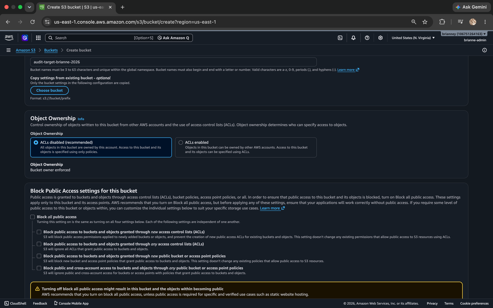
</div>

To simulate the credential exposure, I created a fake configuration file on my Mac and uploaded it to the bucket. I confirmed the file was created correctly by printing its contents in the terminal before uploading.

<div align="center">
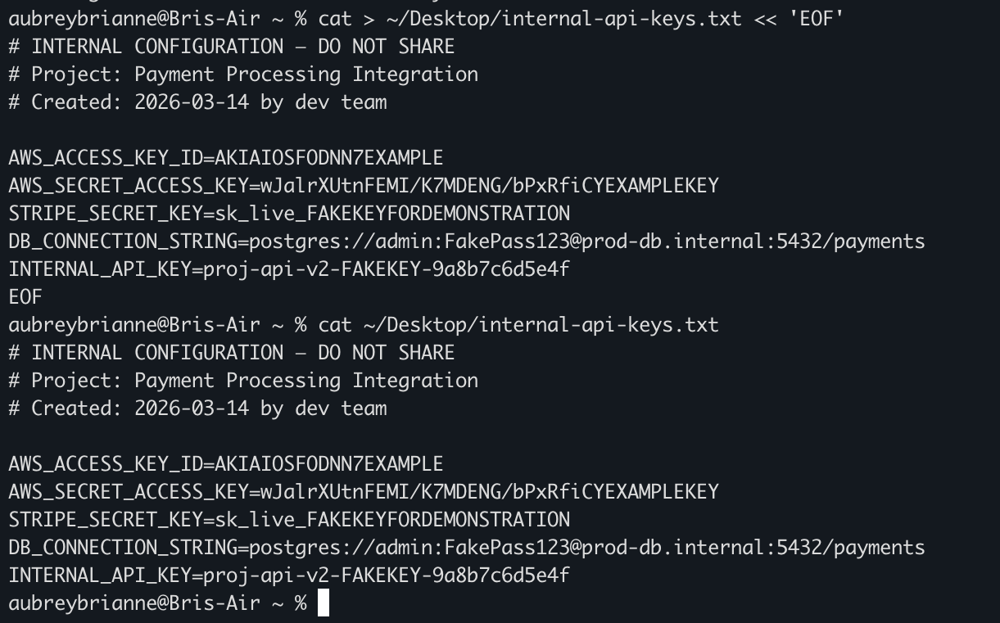
</div>

I then opened the S3 object URL in an incognito browser window with no AWS login, no credentials, and no authentication of any kind. The file loaded immediately.

<div align="center">
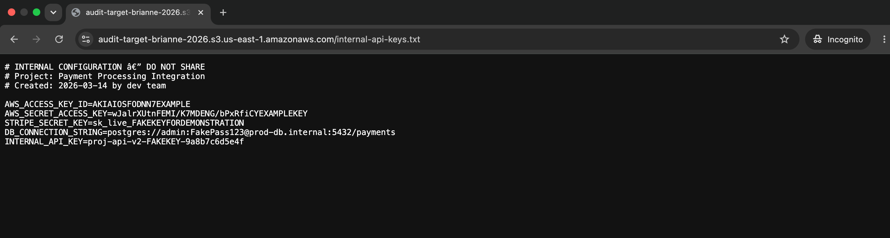
</div>

This is Finding 1 demonstrated. A file containing API keys and database connection strings is readable by anyone who finds the URL. No attack tool required. Just a browser.

---

### Step 2 — Create Misconfiguration 2: IAM User with AdministratorAccess

The second audit target is an IAM user with AdministratorAccess attached directly at the user level rather than through a group. In the scenario, this user was created for a contractor whose engagement ended months ago. The credentials were never deactivated.

I created audit-test-user and attached AdministratorAccess directly.

<div align="center">
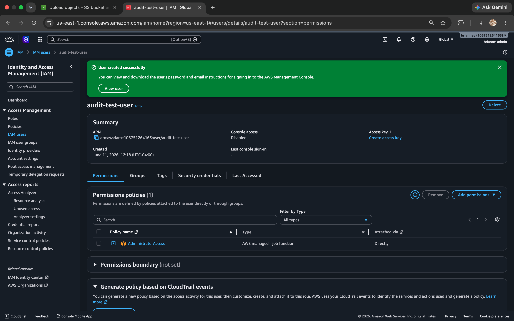
</div>

To demonstrate the blast radius I generated access keys for the user, configured a temporary CLI profile named audit-demo, and ran four commands proving exactly what those credentials can access.

<div align="center">
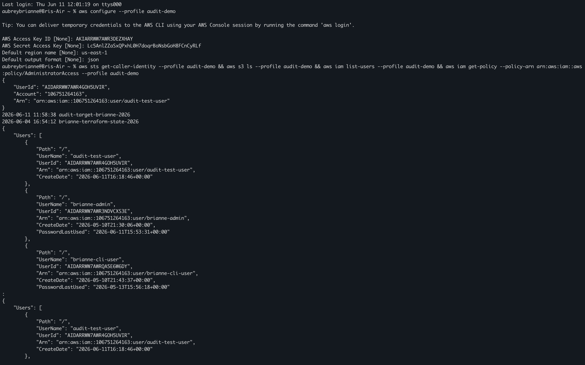
</div>

<div align="center">
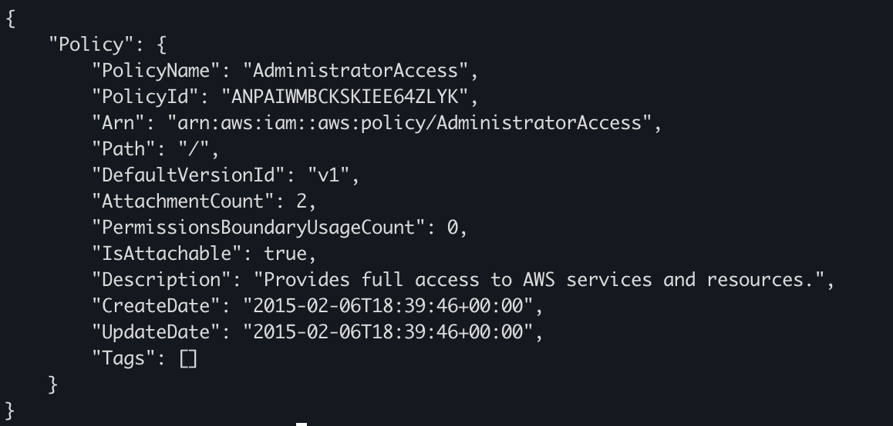
</div>

The output confirmed full account access. The caller identity showed AdministratorAccess, every S3 bucket in the account was listed, every IAM user was visible, and the policy confirmed unrestricted access to all AWS actions and all resources. The access keys were deleted immediately after capturing this output.

This is Finding 2 demonstrated. Anyone who finds these credentials has full administrative control of the AWS account.

---

### Step 3 — Create Misconfiguration 3: Security Group with SSH Open and EC2 Instance

The third audit target is a security group with port 22 open to 0.0.0.0/0. In the scenario, this security group was created during a production debugging session and never cleaned up. An EC2 instance is actively running with it attached.

I created the security group audit-open-ssh-sg with an inbound SSH rule allowing any IPv4 address.

<div align="center">
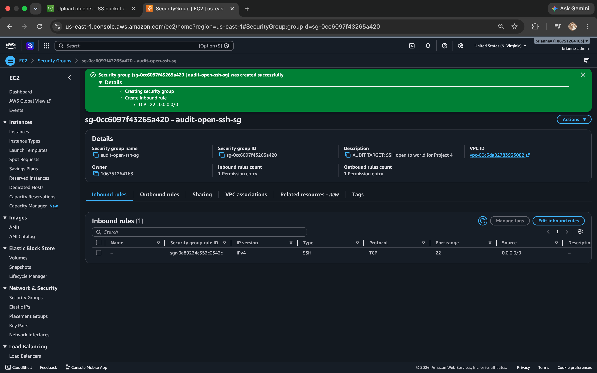
</div>

I then launched a t2.micro EC2 instance with this security group attached to generate real VPC flow log activity for GuardDuty to analyze. A security group sitting idle with no running instance generates no traffic. A running instance with a public IP actively receives connection attempts from internet scanners.

<div align="center">
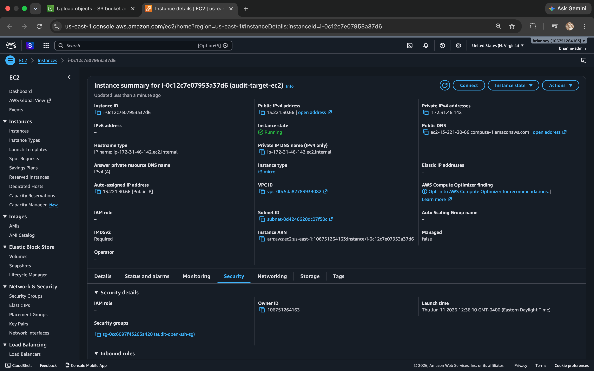
</div>

To accelerate GuardDuty detection I made several intentional failed SSH connection attempts from my Mac terminal using a nonexistent username. Each attempt returned Permission denied, which is logged in VPC flow data that GuardDuty analyzes for brute force patterns.

<div align="center">
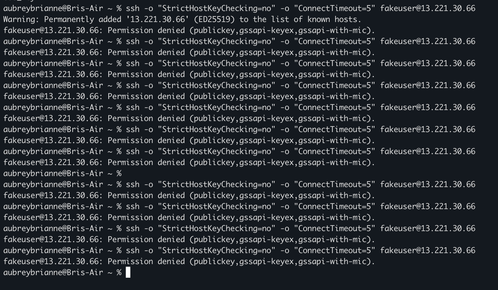
</div>

This is Finding 3 in place. Internet scanners and intentional failed attempts are now generating the activity GuardDuty needs to surface real threat findings.

---

### Step 4 — Enable CloudTrail

CloudTrail must be running before any remediation begins. Every change made from this point forward needs to be logged with a timestamp and identity attached. This is the chain of custody for the audit.

I created the trail project-4-audit-trail with multi-region logging enabled, log file validation turned on, and CloudWatch Logs integration configured. Log file validation creates a cryptographic hash chain proving the logs have not been altered since delivery.

<div align="center">
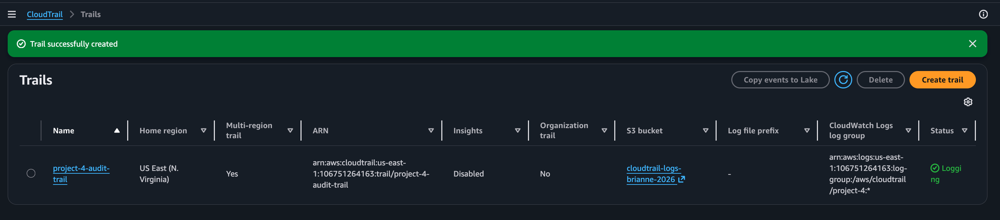
</div>

---

### Step 5 — Enable AWS Config and Compliance Rules

AWS Config is the automated compliance monitor for this project. I set up the recorder for all resources and added three managed rules that map directly to the three misconfigurations created in Steps 1 through 3: s3-bucket-public-read-prohibited, iam-user-no-policies-check, and restricted-ssh.

<div align="center">
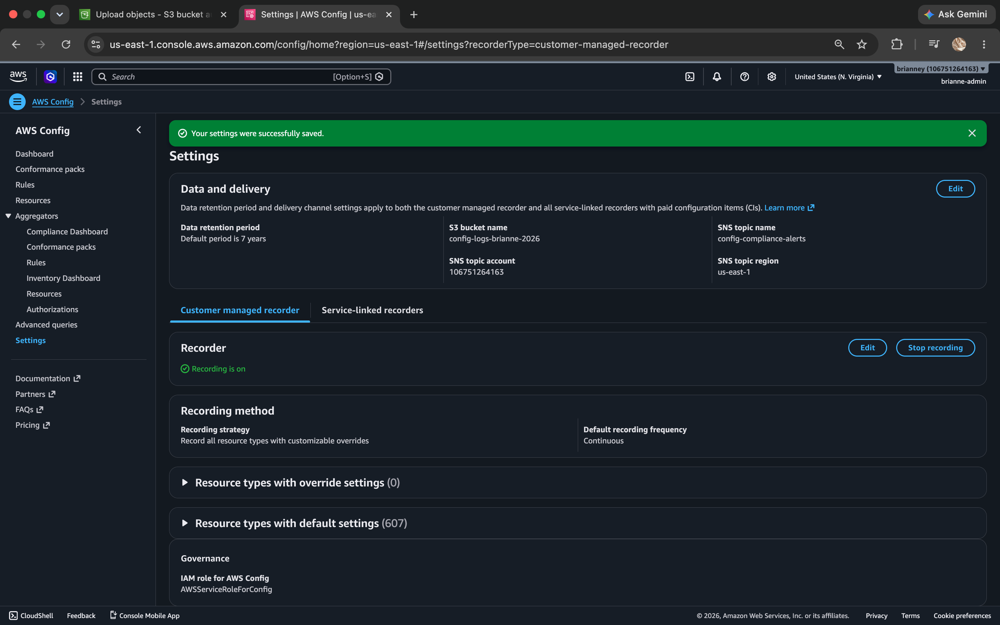
</div>

Within minutes of the rules being saved Config completed its initial evaluation. All three rules returned Noncompliant immediately, confirmed automatically with no manual input required.

<div align="center">
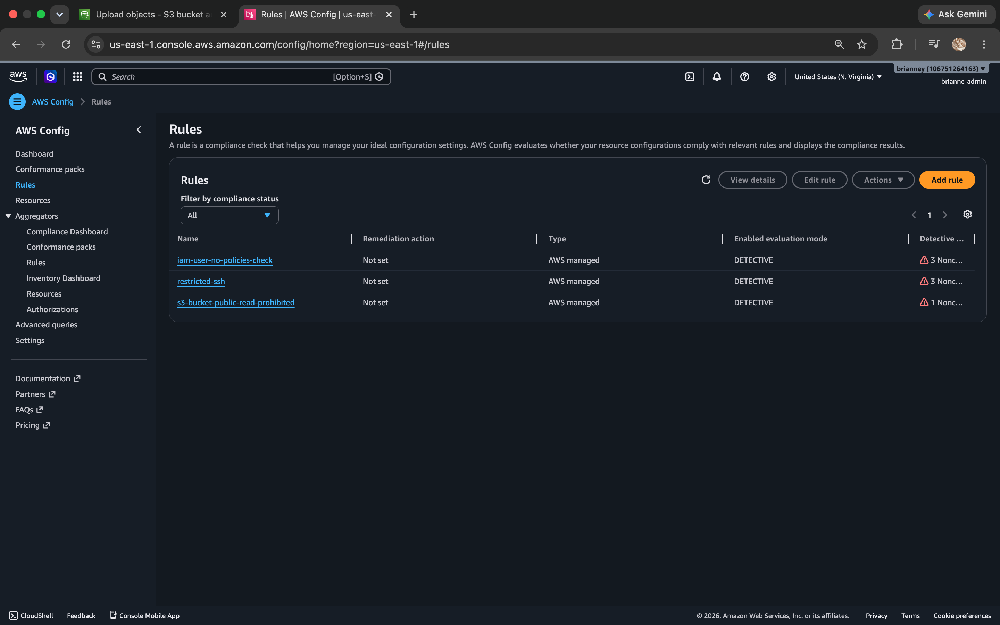
</div>

---

### Step 6 — Enable Security Hub

Security Hub was initially unavailable due to an account plan restriction. After upgrading to a standard AWS account the service became accessible. Security Hub was enabled with both the AWS Foundational Security Best Practices and CIS AWS Foundations Benchmark standards active. It will begin aggregating findings from Config and GuardDuty as those services collect data.

<div align="center">
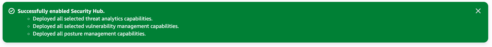
</div>

---

### Step 7 — Enable GuardDuty

GuardDuty was also unavailable under the original account plan and was enabled after the account upgrade. GuardDuty is now analyzing VPC flow logs from the EC2 instance launched in Step 3. It does not require manual VPC flow log configuration — it accesses the underlying flow data independently.

<div align="center">
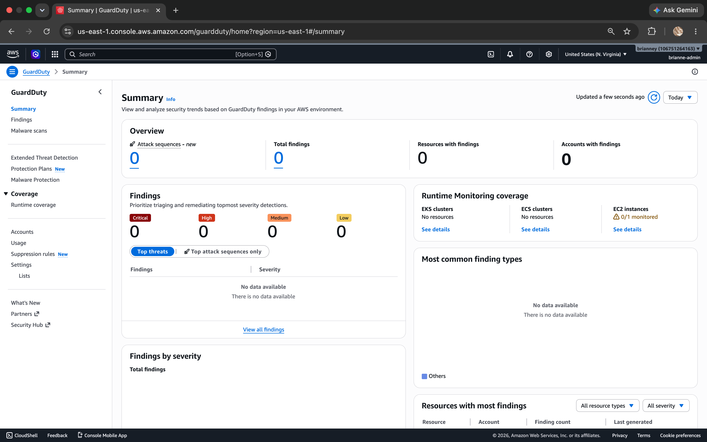
</div>

The 24-hour collection window begins here. GuardDuty will surface SSH brute force findings as internet scanners probe the open port and as the intentional failed attempts from Step 3 are processed. The before state will be fully documented once findings populate.

Steps 8 through 13 will be documented once the 24-hour collection window closes and GuardDuty findings have populated. Check back soon.

---
